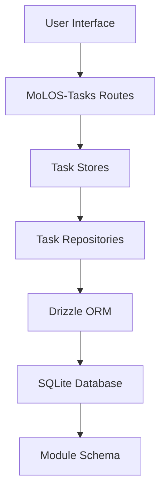

# MoLOS-Tasks: Task Management Module

[](https://github.com/MoLOS-App/MoLOS)

A comprehensive task management module for the MoLOS (Modular Life Organization System) ecosystem. This module provides Eisenhower Matrix-based task prioritization, project organization, area management, and daily logging capabilities.

## 📋 Overview

MoLOS-Tasks is a modular component that integrates seamlessly into the main MoLOS application, providing robust task management functionality while maintaining the core philosophy of modularity and privacy-first design.

### 🎯 Core Features

- **Eisenhower Matrix**: Prioritize tasks based on urgency and importance
- **Project Management**: Organize tasks into projects with flexible hierarchies
- **Area Organization**: Group related projects and tasks into logical areas
- **Daily Logging**: Track daily progress and maintain productivity journals
- **Smart Filtering**: Advanced filtering and search capabilities
- **Real-time Updates**: Live synchronization across the application

## 🔗 Relationship to MoLOS

### Architecture Integration

MoLOS-Tasks operates as a **plug-and-play module** within the MoLOS ecosystem:

```
MoLOS (Core Application)
├── Core Framework (SvelteKit, Drizzle, etc.)
├── Module System
│   ├── Auto-discovery
│   ├── Dynamic Linking
│   └── Database Synchronization
└── MoLOS-Tasks (This Module)
    ├── UI Routes (/ui/tasks/*)
    ├── API Endpoints (/api/tasks/*)
    ├── Database Schema (tasks_* tables)
    └── Shared Components
```

### Data Flow



### Module Lifecycle

1. **Discovery**: MoLOS scans for `MoLOS-*` folders in the workspace
2. **Registration**: Module metadata is stored in the core database
3. **Standardization**: Import paths and routing are automatically adjusted
4. **Database Sync**: Module-specific tables are created via Drizzle migrations
5. **Linking**: UI routes and API endpoints are symlinked into the main app
6. **Activation**: Module becomes available in the unified interface

## 🚀 Getting Started

### Prerequisites

- MoLOS core application installed and running
- Node.js 20+
- SQLite database

### Installation

1. **Place the Module**:
   ```bash
   # Copy MoLOS-Tasks folder to the external_modules directory
   cp -r MoLOS-Tasks ../MoLOS/external_modules/
   ```

2. **Sync Modules**:
   ```bash
   cd ../MoLOS
   npm run modules:sync
   ```

3. **Access the Module**:
   - Navigate to `/tasks` in your MoLOS application
   - The module will be automatically integrated into the main navigation

### Development Setup

For standalone development:

```bash
cd MoLOS-Tasks
npm install
npm run dev
```

For orchestrated development with MoLOS core:

```bash
cd ../MoLOS
npm run dev:all
```

## 🏗️ Architecture

### Database Schema

All tables are prefixed with `tasks_` to maintain namespace isolation:

```sql
-- Core task entity
tasks_tasks (
  id INTEGER PRIMARY KEY,
  title TEXT NOT NULL,
  description TEXT,
  status tasks_status_enum,
  priority tasks_priority_enum,
  created_at DATETIME DEFAULT CURRENT_TIMESTAMP,
  updated_at DATETIME DEFAULT CURRENT_TIMESTAMP
)

-- Eisenhower Matrix relationships
tasks_task_matrix (
  task_id INTEGER REFERENCES tasks_tasks(id),
  quadrant tasks_quadrant_enum,
  urgency_score INTEGER,
  importance_score INTEGER
)
```

### Repository Pattern

```typescript
// lib/repositories/task-repository.ts
export class TaskRepository extends BaseRepository {
  async findByMatrixQuadrant(quadrant: Quadrant): Promise<Task[]> {
    return this.db
      .select()
      .from(tasksTable)
      .where(eq(tasksTable.quadrant, quadrant));
  }
}
```

### Store Management

```typescript
// lib/stores/tasks.store.ts
export class TaskStore {
  private tasks = writable<Task[]>([]);

  constructor(private repository: TaskRepository) {
    this.loadTasks();
  }

  async createTask(data: CreateTaskData) {
    const task = await this.repository.create(data);
    this.tasks.update(tasks => [...tasks, task]);
  }
}
```

## 🔧 Development Guidelines

### Code Organization

Follow the established MoLOS patterns:

```
MoLOS-Tasks/
├── lib/
│   ├── components/          # Reusable UI components
│   ├── models/             # TypeScript interfaces/types
│   ├── repositories/       # Data access layer
│   ├── stores/            # State management
│   └── server/            # Server-side utilities
├── routes/
│   ├── ui/                # Svelte pages and layouts
│   └── api/               # API endpoints
└── drizzle/               # Database migrations
```

### Naming Conventions

- **Database**: All tables/enums prefixed with `tasks_`
- **Components**: PascalCase for component names
- **Stores**: camelCase with descriptive names
- **API Routes**: RESTful patterns (`/api/tasks/[id]`)

### Import Path Standards

Use relative imports within the module. The MoLOS core will automatically standardize paths during integration:

```typescript
// ✅ Correct: Relative imports
import { TaskStore } from '../stores/task.store';
import { TaskRepository } from '../repositories/task-repository';

// ❌ Avoid: Absolute imports (will be rewritten by core)
import { TaskStore } from '$lib/stores/task.store';
```

### Database Migrations

Always create migrations for schema changes:

```bash
# Generate migration
npx drizzle-kit generate

# Apply migration
npx drizzle-kit push
```

### State Management

Use Svelte stores for reactive state:

```typescript
// lib/stores/tasks.store.ts
import { writable } from 'svelte/store';

export const tasksStore = writable<Task[]>([]);

// For complex state management
export class TaskManager {
  private tasks = writable<Task[]>([]);

  subscribe = this.tasks.subscribe;
  update = this.tasks.update;
}
```

## 🛡️ Best Practices

### Avoiding Breaking Changes

1. **API Stability**: Maintain backward compatibility in API responses
2. **Database Schema**: Use additive changes; avoid dropping columns
3. **Component Props**: Keep component interfaces stable
4. **Store Contracts**: Don't change store method signatures unexpectedly

### Error Handling

```typescript
// ✅ Good: Comprehensive error handling
export async function createTask(data: TaskData): Promise<Task> {
  try {
    const validated = taskSchema.parse(data);
    const task = await this.repository.create(validated);
    return task;
  } catch (error) {
    if (error instanceof ZodError) {
      throw new ValidationError('Invalid task data', error.errors);
    }
    throw new DatabaseError('Failed to create task', error);
  }
}
```

### Testing

```typescript
// lib/repositories/task-repository.spec.ts
describe('TaskRepository', () => {
  let repository: TaskRepository;

  beforeEach(() => {
    repository = new TaskRepository(db);
  });

  it('should create a task', async () => {
    const task = await repository.create({
      title: 'Test Task',
      quadrant: 'urgent_important'
    });

    expect(task.id).toBeDefined();
    expect(task.title).toBe('Test Task');
  });
});
```

### Performance Considerations

1. **Lazy Loading**: Load data on-demand
2. **Pagination**: Implement for large datasets
3. **Memoization**: Cache expensive computations
4. **Debouncing**: For search and filter operations

## 🔄 Integration Examples

### Using Task Components

```svelte
<!-- routes/ui/dashboard/+page.svelte -->
<script>
  import { TaskItem } from '$lib/components/task-item';
  import { tasksStore } from '$lib/stores/tasks.store';
</script>

{#each $tasksStore as task}
  <TaskItem {task} on:complete={handleComplete} />
{/each}
```

### API Integration

```typescript
// routes/api/tasks/+server.ts
import { TaskRepository } from '$lib/repositories/task-repository';
import { json } from '@sveltejs/kit';

export async function GET({ url }) {
  const repository = new TaskRepository();
  const quadrant = url.searchParams.get('quadrant');

  const tasks = await repository.findByQuadrant(quadrant);
  return json(tasks);
}
```

### Cross-Module Communication

```typescript
// Integration with other MoLOS modules
import { notesApi } from '$lib/modules/notes/api';

export class TaskService {
  async linkToNote(taskId: number, noteId: number) {
    // Link task to knowledge module note
    await notesApi.linkEntity(noteId, 'task', taskId);
  }
}
```

## 🐛 Troubleshooting

### Common Issues

1. **Module Not Loading**:
   - Ensure `manifest.yaml` is valid
   - Check that `npm run modules:sync` completed successfully
   - Verify database migrations ran

2. **Import Errors**:
   - Use relative imports within the module
   - Avoid `$lib` aliases (handled by core)

3. **Database Conflicts**:
   - Ensure table prefixes are unique
   - Check migration order in `drizzle.config.ts`

### Debug Commands

```bash
# Check module status
npm run modules:sync -- --verbose

# View database schema
npx drizzle-kit studio

# Run tests
npm test
```

## 🤝 Contributing

1. Follow the [MoLOS Development Guide](../MoLOS/docs/guides/developing-new-modules/)
2. Maintain test coverage above 80%
3. Update documentation for API changes
4. Use conventional commits

## 📄 License

Licensed under the Apache License 2.0 - see the [LICENSE](LICENSE) file for details.

---

**MoLOS-Tasks** is part of the MoLOS ecosystem. For more information about MoLOS, visit [molos-app.github.io](https://molos-app.github.io).